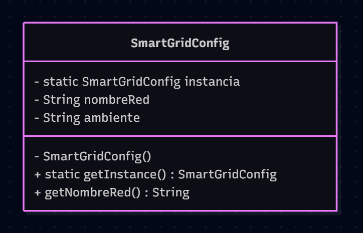
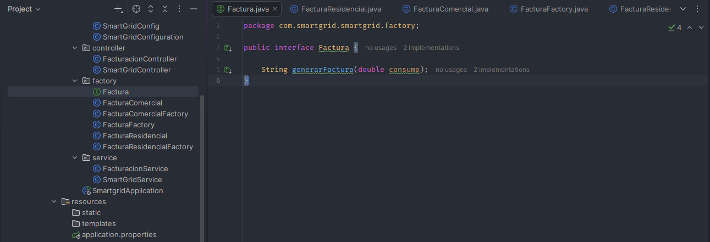
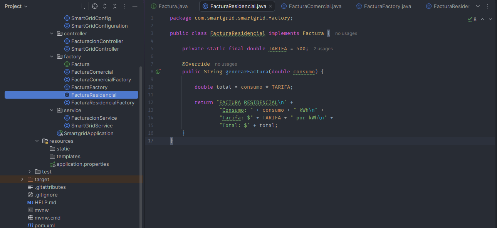
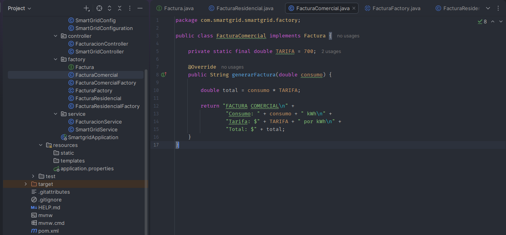
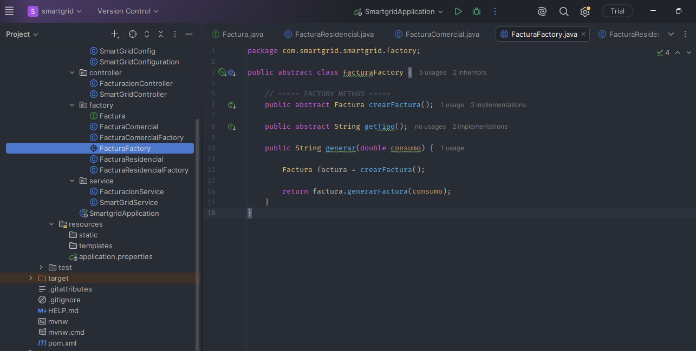
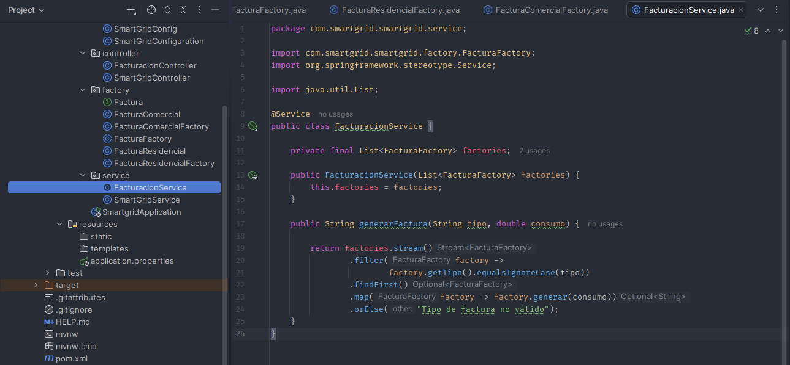
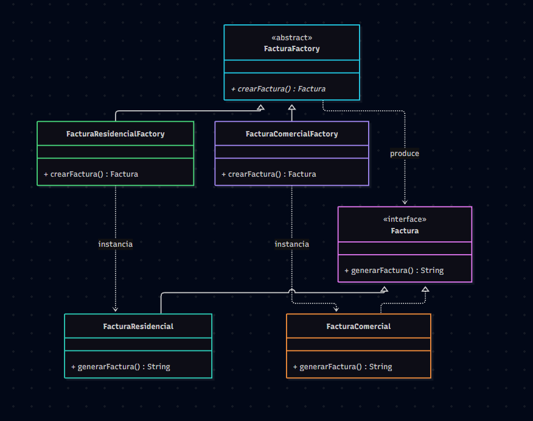
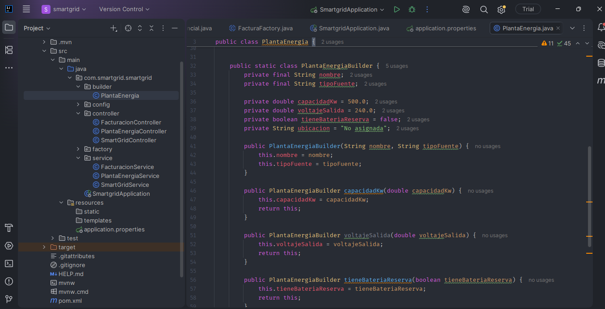
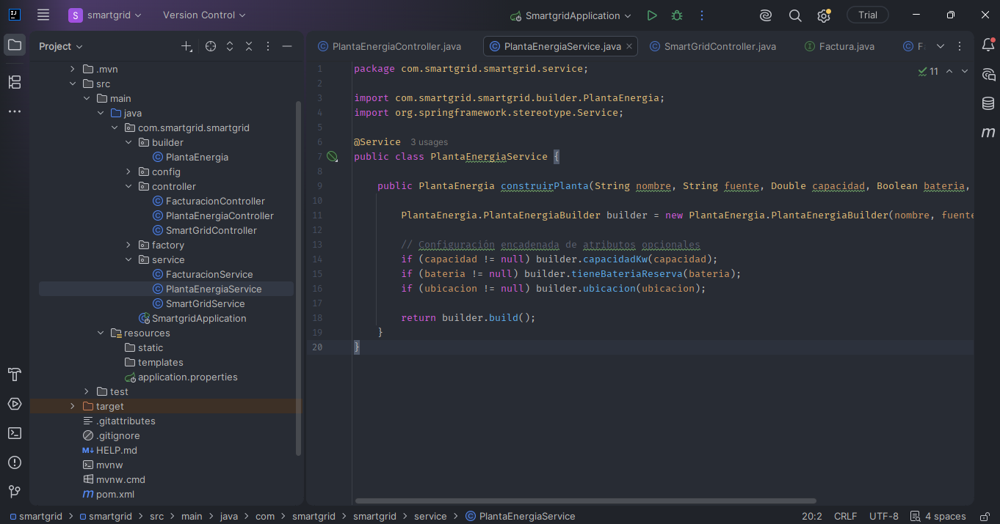
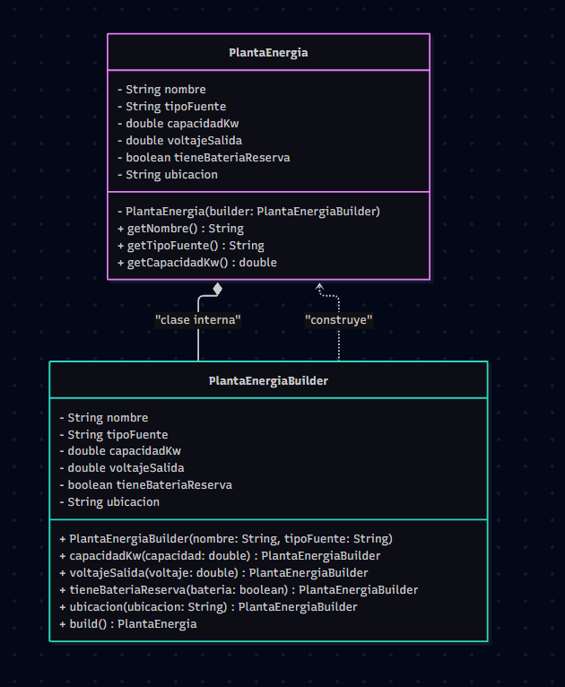

# Proyecto_Patrones
Los patrones de software son soluciones reutilizables para problemas comunes que aparecen durante el diseño y desarrollo de aplicaciones. No representan código listo para copiar y pegar, sino que funcionan como guías o modelos de diseño que permiten organizar el software de una manera más eficiente, mantenible y escalable.

La implementación de patrones de software permite mejorar la organización del código, resolver problemas recurrentes y facilitar el mantenimiento y la evolución de los sistemas. Por esta razón, en este proyecto se implementarán diferentes patrones de software sobre el proyecto Smart Grid, con el propósito de mejorar progresivamente su estructura, calidad y organización.

## Smart Grid

Smart Grid es un sistema de gestión de redes eléctricas inteligentes enfocado en el monitoreo y administración del consumo energético. El proyecto será actualizado progresivamente mediante la implementación de diferentes patrones de software, buscando mejorar la calidad del código, reducir el acoplamiento entre sus componentes y facilitar su mantenimiento y extensión. 

> **Nota:** Los pasos e instrucciones para descargar y ejecutar Smartgrid se encuentran al final del documento 

### Objetivo general
Desarrollar un sistema de gestión de redes inteligentes (Smart Grid) que permita monitorear y administrar el consumo energético en tiempo real, optimizar la distribución de la energía mediante el balanceo de cargas, integrar fuentes de energía renovable y gestionar un sistema de facturación dinámica.

### Objetivos específicos
•	Implementar un sistema de monitoreo del consumo energético en tiempo real que permita visualizar y registrar el uso de energía de los usuarios 

•	Desarrollar mecanismos de balanceo de carga y gestión de picos de consumo

•	Integrar fuentes de energía renovable como energía solar o eólica, permitiendo registrar y gestionar la energía generada y su incorporación a la red.

•	Diseñar un sistema de facturación dinámica que permita calcular el costo del consumo energético de acuerdo con variables como el horario, la demanda y el consumo registrado.

•	Desarrollar un panel de gestión y visualización que permita consultar información sobre consumo, generación, demanda, costos y estado general de la red.

### Patron Singleton

El sistema implementará el patrón de diseño Singleton, utilizado para garantizar que determinados componentes de la Smart Grid cuenten con una única instancia y puedan ser gestionados de manera centralizada.

En nuestro proyecto Smart Grid lo utilizamos en la clase SmartGridConfig, porque queremos tener una única configuración general del sistema. Por ejemplo, el nombre del sistema, si está activo o inactivo y posteriormente parámetros como la tarifa eléctrica o los límites de consumo


La parte del código que se ve afectada principalmente es la clase SmartGridConfig. Ahí se implementa el Singleton mediante una variable estática que almacena la instancia, un constructor privado que evita crear objetos desde otras clases y el método getInstancia(), que permite obtener siempre la misma instancia.


### Diagrama UML Singleton



### Video Patrón Singleton
[](https://www.youtube.com/watch?v=1u5A9hnG09Y)

### Patron factory method

El segundo patrón que implementamos en nuestro proyecto SmartGrid es el patrón Factory Method, aplicado dentro del módulo de facturación. Toda la estructura de este patrón se encuentra organizada dentro del paquete com.smartgrid.smartgrid.factory, comunicándose directamente con la capa de service y controller.

La idea principal es que SmartGrid pueda manejar diferentes tipos de facturas (como residenciales y comerciales) con sus respectivas formas de calcular tarifas, sin acoplar la lógica de negocio a clases concretas.

Para implementar el patrón, primero definimos la interfaz Factura dentro de la carpeta factory, la cual actúa como el Producto Abstracto estableciendo el contrato general mediante el método generarFactura().



A partir de esta interfaz, creamos FacturaResidencial y FacturaComercial, que representan los Productos Concretos. En estas clases se implementa la lógica específica de tarifa y formato según la categoría del usuario.





Luego, creamos la clase abstracta FacturaFactory, que cumple el rol de Creador Abstracto. Aquí se encuentra el núcleo del patrón: el método abstracto crearFactura(), que es formalmente el Factory Method.



Este método define qué objeto de tipo Factura debe ser creado, pero deja que las clases hijas (Creadores Concretos) decidan exactamente qué implementación instanciar. Por ejemplo, tenemos FacturaResidencialFactory, que cuando ejecuta crearFactura() retorna una FacturaResidencial, y tenemos FacturaComercialFactory, que retorna una FacturaComercial.

Por su parte, en el servicio FacturacionService (ubicado en el paquete service) no creamos directamente las facturas residenciales o comerciales. El servicio opera como cliente del patrón trabajando con la abstracción FacturaFactory mediante la inyección de dependencias de Spring.



Esta lógica se conecta con el exterior a través de FacturacionController (en el paquete controller), el cual expone el endpoint REST /api/facturacion. Al ingresar una petición HTTP especificando el tipo de cliente y el consumo, el controlador transfiere los datos a FacturacionService, el cual busca la fábrica correspondiente, ejecuta su Factory Method y retorna el cálculo en formato JSON.

De esta manera, si en el futuro necesitamos agregar una factura industrial, simplemente creamos FacturaIndustrial y FacturaIndustrialFactory dentro del paquete factory, sin necesidad de modificar la lógica de FacturacionService ni del controlador. Así, Factory Method logra separar por completo la creación de los objetos de su utilización, haciendo que el sistema sea mucho más fácil de ampliar y mantener.

### Diagrama UML Factory Method



### Video Patrón Factory Method

[](https://www.youtube.com/watch?v=Ty08ICiVTJ0)

### Patron Builder

Este módulo incorpora el patrón creacional Builder para gestionar la construcción flexible inmutable de objetos de infraestructura en la red eléctrica, como plantas de energía. Su adición permite instanciar componentes de red diferenciando estrictamente los datos obligatorios de los opcionales. De esta forma, el proyecto evita la creación de constructores recargados o el envío repetitivo de valores nulos, al mismo tiempo que garantiza la inmutabilidad de los datos en memoria y expone un servicio REST preparado para conectarse con Angular sin requerir cambios en la base de datos.

La aplicación del patrón se realiza definiendo la clase principal PlantaEnergia con un constructor privado que incorpora dentro una clase estática estandarizada denominada PlantaEnergiaBuilder. El constructor del builder exige obligatoriamente los parámetros nombre y tipoFuente, mientras que los métodos encadenados como capacidadKw o ubicacion configuran las propiedades opcionales antes de ejecutar el método final build para obtener la instancia definitiva.

En cuanto al detalle del código, el archivo PlantaEnergia.java define la estructura de datos con atributos privados y finales para asegurar su inmutabilidad, conteniendo la clase interna PlantaEnergiaBuilder que asigna valores por defecto a las propiedades opcionales y proporciona la interfaz de encadenamiento. 



Por su parte, el archivo PlantaEnergiaService.java se encarga de la orquestación de negocio al recibir los valores de la petición, inicializar el builder con los campos requeridos, evaluar qué atributos opcionales fueron enviados y retornar la planta construida.


Finalmente, el archivo PlantaEnergiaController.java habilita el punto de entrada REST en la ruta /api/planta/crear con soporte para peticiones cruzadas mediante la anotación CrossOrigin. Este controlador recibe las solicitudes HTTP procesando los parámetros obligatorios y opcionales, delega la construcción al servicio de negocio y devuelve la respuesta en un objeto estructurado en formato JSON listo para el consumo del cliente



### Diagrama UML patrón Builder



### Video Patrón Builder
[](https://www.youtube.com/watch?v=ghf-MfEC9mA)

### Patrón Abstract Factory

El patrón Abstract Factory sirve para crear familias de objetos relacionados o dependientes sin especificar sus clases concretas. Sin embargo, no se incluye en Smart Grid porque la arquitectura del backend está organizada en módulos autónomos (factory, config y builder) que no requieren instanciar grupos de objetos interdependientes en bloque. Dado que la facturación, la configuración de la red y el registro de la infraestructura operan de manera totalmente independiente, implementar este patrón obligaría a añadir interfaces y fábricas multinivel que solo aportarían complejidad estructural y sobrediseño sin generar ningún beneficio en la evolución del código.

### Patrón Prototype

Por su parte, el patrón Prototype sirve para crear nuevos objetos clonando o copiando instancias ya existentes en memoria, evitando el costo de una inicialización desde cero. Este patrón se descarta en el proyecto debido a que no se alinea con el modelo de desarrollo de nuestra API REST en Spring Boot, la cual opera de forma sin estado (stateless) recibiendo parámetros directamente del cliente en Angular mediante solicitudes HTTP. En este flujo, cada objeto debe construirse dinámicamente a partir del payload JSON de la petición, una necesidad de instanciación flexible e inmutable que ya queda completamente cubierta en la capa de negocio mediante el patrón Builder.

# Ejecución del proyecto SmartGrid

## 1. Requisitos

Para ejecutar el proyecto SmartGrid se necesitan las siguientes herramientas:

* **IntelliJ IDEA** o Visual Studio Code.
* **Java JDK 21**.
* **PostgreSQL**.
* **pgAdmin 4**.
* Conexión a Internet para descargar las dependencias de Maven.

En este proyecto se utilizó principalmente **IntelliJ IDEA** para el desarrollo y **PostgreSQL** como sistema gestor de bases de datos.

---

# 2. Descargar el proyecto

El código fuente del proyecto se encuentra disponible en GitHub.

### Código fuente de SmartGrid

[Descargar proyecto SmartGrid](https://github.com/juandpl18/Proyecto_Patrones/tree/main/smartgrid/smartgrid)

También se encuentra dentro del repositorio principal:

```text
Proyecto_Patrones
│
├── smartgrid
│   └── smartgrid
│
└── Base de datos
    └── smartgrid.sql
```

Se puede descargar el repositorio completo utilizando el botón **Code → Download ZIP** de GitHub o mediante Git:

```bash
git clone https://github.com/juandpl18/Proyecto_Patrones.git
```

Después de descargarlo, se debe localizar la carpeta:

```text
Proyecto_Patrones/smartgrid/smartgrid
```

---

# 3. Abrir el proyecto en IntelliJ IDEA

1. Abrir **IntelliJ IDEA**.
2. Seleccionar:

```text
File → Open
```

3. Buscar la carpeta:

```text
Proyecto_Patrones/smartgrid/smartgrid
```

4. Seleccionar la carpeta y abrir el proyecto.
5. IntelliJ detectará el archivo:

```text
pom.xml
```

6. Esperar a que Maven descargue todas las dependencias necesarias.

El proyecto está desarrollado con **Spring Boot**, por lo que Maven se encargará de descargar las librerías definidas en `pom.xml`.

---

# 4. Verificar Java

El proyecto utiliza **Java 21**.

En IntelliJ se debe verificar:

```text
File → Project Structure → Project
```

y comprobar que el SDK seleccionado sea:

```text
Java 21
```

También se puede verificar desde la terminal:

```bash
java -version
```

Debe aparecer una versión correspondiente a Java 21.

---

# 5. Instalar y preparar PostgreSQL

El proyecto utiliza PostgreSQL como base de datos.

Abrir **pgAdmin 4** y conectarse al servidor PostgreSQL.

Crear una nueva base de datos llamada:

```text
smartgrid
```

La estructura debe quedar:

```text
Servers
└── PostgreSQL
    └── Databases
        └── smartgrid
```

---

# 6. Importar la base de datos

Dentro del repositorio se encuentra el archivo:

[smartgrid.sql](https://github.com/juandpl18/Proyecto_Patrones/blob/main/Base%20de%20datos/smartgrid.sql)

ubicado en:

```text
Base de datos/smartgrid.sql
```

Este archivo corresponde al respaldo de la base de datos PostgreSQL.

Para restaurarlo desde pgAdmin se puede utilizar **Query Tool** y ejecutar el contenido del archivo SQL.

También se puede utilizar la opción de restauración de PostgreSQL cuando el formato del respaldo lo permita.

> **Nota:** antes de ejecutar el proyecto se debe comprobar que el archivo `smartgrid.sql` contenga las instrucciones `CREATE TABLE`, restricciones y, si corresponde, los datos de prueba. Si el archivo solo contiene la cabecera del `pg_dump`, se debe generar nuevamente el respaldo desde pgAdmin.

---

# 7. Configurar la conexión con PostgreSQL

Dentro del proyecto se encuentra:

```text
src
└── main
    └── resources
        └── application.properties
```

La configuración debe apuntar a la base de datos `smartgrid`.

Ejemplo:

```properties
spring.application.name=smartgrid

spring.datasource.url=jdbc:postgresql://localhost:5432/smartgrid
spring.datasource.username=postgres
spring.datasource.password=TU_CONTRASEÑA

spring.jpa.hibernate.ddl-auto=update
spring.jpa.show-sql=true
spring.jpa.properties.hibernate.format_sql=true
```

Se debe reemplazar:

```text
TU_CONTRASEÑA
```

por la contraseña correspondiente al usuario de PostgreSQL.

## Importante

No se debe publicar una contraseña real de PostgreSQL en GitHub.

Para una instalación local se puede utilizar la contraseña propia de cada equipo.

---

# 8. Verificar la conexión con PostgreSQL

Antes de ejecutar el proyecto, comprobar que:

* PostgreSQL esté ejecutándose.
* La base de datos se llame `smartgrid`.
* El puerto sea `5432`, salvo que se haya configurado otro.
* El usuario de PostgreSQL sea correcto.
* La contraseña sea correcta.
* La URL de conexión coincida con la configuración de `application.properties`.

La configuración utilizada originalmente por el proyecto es:

```text
Host: localhost
Puerto: 5432
Base de datos: smartgrid
Usuario: postgres
```

---

# 9. Ejecutar SmartGrid

En IntelliJ localizar la clase principal del proyecto:

```text
src
└── main
    └── java
        └── com.smartgrid.smartgrid
            └── SmartgridApplication.java
```

Abrir la clase y presionar:

```text
▶ Run
```

También se puede ejecutar desde Maven mediante:

```bash
mvn spring-boot:run
```

Si la ejecución es correcta, en la consola de IntelliJ aparecerá el inicio de Spring Boot y el servidor quedará disponible normalmente en:

```text
http://localhost:8080
```

---

# 10. Comprobar que SmartGrid está funcionando

Una vez iniciado el proyecto, se pueden utilizar los endpoints disponibles en el proyecto.

Por ejemplo, para consultar el estado del sistema:

```text
http://localhost:8080/smartgrid/estado
```

Si el sistema está activo, se mostrará:

```text
SmartGrid está ACTIVO
```

Este endpoint permite comprobar también el funcionamiento del patrón **Singleton**, ya que el estado se obtiene desde la instancia única de `SmartGridConfig`.

---

# 11. Probar el patrón Factory Method

El patrón Factory Method se implementó en el módulo de facturación.

Para generar una factura residencial:

```text
http://localhost:8080/facturacion/generar?tipo=RESIDENCIAL&consumo=350
```

Para una factura comercial:

```text
http://localhost:8080/facturacion/generar?tipo=COMERCIAL&consumo=350
```

El sistema selecciona la fábrica correspondiente y genera el tipo de factura solicitado.

La estructura principal es:

```text
FacturaFactory
├── FacturaResidencialFactory
│   └── FacturaResidencial
│
└── FacturaComercialFactory
    └── FacturaComercial
```

---

# 12. Probar el patrón Builder

El patrón Builder se implementó en la construcción de una `PlantaEnergia`.

El endpoint utilizado es:

```text
/api/planta/crear
```

Por ejemplo:

```text
http://localhost:8080/api/planta/crear?nombre=PlantaSolar&fuente=SOLAR&capacidad=1000&bateria=true&ubicacion=Bucaramanga
```

El controlador recibe los parámetros y el servicio utiliza `PlantaEnergiaBuilder` para construir el objeto.

El proceso es:

```text
Controller
    ↓
PlantaEnergiaService
    ↓
PlantaEnergiaBuilder
    ↓
build()
    ↓
PlantaEnergia
```

El resultado se devuelve como un objeto JSON.

---

# 13. Estructura general del proyecto

La estructura principal de SmartGrid es:

```text
smartgrid
│
├── src
│   └── main
│       ├── java
│       │   └── com.smartgrid.smartgrid
│       │       ├── builder
│       │       │   └── PlantaEnergia.java
│       │       │
│       │       ├── config
│       │       │   └── SmartGridConfig.java
│       │       │
│       │       ├── controller
│       │       │
│       │       ├── factory
│       │       │   ├── Factura.java
│       │       │   ├── FacturaFactory.java
│       │       │   ├── FacturaResidencial.java
│       │       │   ├── FacturaResidencialFactory.java
│       │       │   ├── FacturaComercial.java
│       │       │   └── FacturaComercialFactory.java
│       │       │
│       │       └── service
│       │
│       └── resources
│           └── application.properties
│
├── pom.xml
└── README.md
```

---

# 14. Patrones de diseño implementados

Actualmente SmartGrid implementa los siguientes patrones:

### Singleton

Utilizado para controlar la configuración y el estado global de SmartGrid.

```text
SmartGridConfig
```

### Factory Method

Utilizado en el módulo de facturación para crear diferentes tipos de factura.

```text
FacturaFactory
├── FacturaResidencialFactory
└── FacturaComercialFactory
```

### Builder

Utilizado para construir objetos `PlantaEnergia` de manera flexible y ordenada.

```text
PlantaEnergia
└── PlantaEnergiaBuilder
```

Otros patrones como **Prototype** y **Abstract Factory** no fueron incorporados debido a que actualmente no existe una necesidad funcional dentro del proyecto que justifique su utilización. De esta manera se evita agregar clases o funcionalidades únicamente para demostrar un patrón y se mantiene el diseño enfocado en las necesidades reales de SmartGrid.

---

# 15. Resumen de ejecución

El proceso completo para ejecutar el proyecto es:

```text
1. Descargar/clonar el repositorio
        ↓
2. Abrir smartgrid/smartgrid en IntelliJ IDEA
        ↓
3. Verificar Java 21
        ↓
4. Instalar/iniciar PostgreSQL
        ↓
5. Crear la base de datos smartgrid
        ↓
6. Importar smartgrid.sql
        ↓
7. Configurar application.properties
        ↓
8. Verificar usuario y contraseña de PostgreSQL
        ↓
9. Ejecutar SmartgridApplication
        ↓
10. Acceder a localhost:8080
        ↓
11. Probar los endpoints
```

Con estos pasos se puede descargar, configurar y ejecutar el proyecto SmartGrid en un equipo diferente al utilizado durante el desarrollo.


