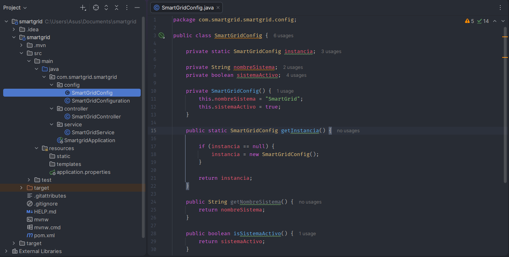
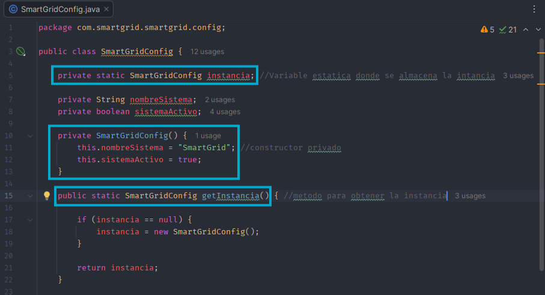

# Proyecto_Patrones
Los patrones de software son soluciones reutilizables para problemas comunes que aparecen durante el diseño y desarrollo de aplicaciones. No representan código listo para copiar y pegar, sino que funcionan como guías o modelos de diseño que permiten organizar el software de una manera más eficiente, mantenible y escalable.

La implementación de patrones de software permite mejorar la organización del código, resolver problemas recurrentes y facilitar el mantenimiento y la evolución de los sistemas. Por esta razón, en este proyecto se implementarán diferentes patrones de software sobre el proyecto Smart Grid, con el propósito de mejorar progresivamente su estructura, calidad y organización.

## Smart Grid

Smart Grid es un sistema de gestión de redes eléctricas inteligentes enfocado en el monitoreo y administración del consumo energético. El proyecto será actualizado progresivamente mediante la implementación de diferentes patrones de software, buscando mejorar la calidad del código, reducir el acoplamiento entre sus componentes y facilitar su mantenimiento y extensión. 

### Objetivo general
Desarrollar un sistema de gestión de redes inteligentes (Smart Grid) que permita monitorear y administrar el consumo energético en tiempo real, optimizar la distribución de la energía mediante el balanceo de cargas, integrar fuentes de energía renovable y gestionar un sistema de facturación dinámica.

### Objetivos específicos
•	Implementar un sistema de monitoreo del consumo energético en tiempo real que permita visualizar y registrar el uso de energía de los usuarios 

•	Desarrollar mecanismos de balanceo de carga y gestión de picos de consumo

•	Integrar fuentes de energía renovable como energía solar o eólica, permitiendo registrar y gestionar la energía generada y su incorporación a la red.

•	Diseñar un sistema de facturación dinámica que permita calcular el costo del consumo energético de acuerdo con variables como el horario, la demanda y el consumo registrado.

•	Desarrollar un panel de gestión y visualización que permita consultar información sobre consumo, generación, demanda, costos y estado general de la red.

### Patron Singleton

El sistema implementará el patrón de diseño Singleton, utilizado para garantizar que determinados componentes de la Smart Grid cuenten con una única instancia y puedan ser gestionados de manera centralizada.

En nuestro proyecto Smart Grid lo utilizamos en la clase SmartGridConfig, porque queremos tener una única configuración general del sistema. Por ejemplo, el nombre del sistema, si está activo o inactivo y posteriormente parámetros como la tarifa eléctrica o los límites de consumo

La parte del código que se ve afectada principalmente es la clase SmartGridConfig. Ahí se implementa el Singleton mediante una variable estática que almacena la instancia, un constructor privado que evita crear objetos desde otras clases y el método getInstancia(), que permite obtener siempre la misma instancia.

### Video Patrón Singleton

### Bibliografia basica:
https://profile.es/blog/patrones-de-diseno-de-software/
